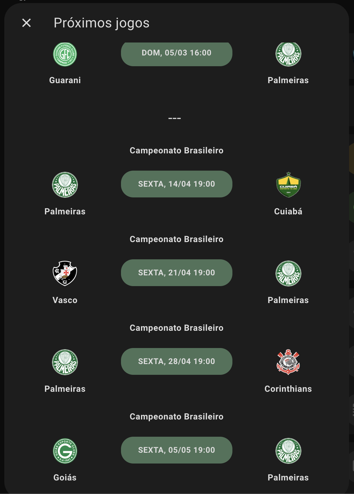

# homeassistant-futebol

Este script Python usa a biblioteca Requests e BeautifulSoup, fazendo Webscrapping no site placardefutebol.com.br para obter informações dos próximos jogos do Palmeiras. Ele salva as informações em um dicionário Python e imprime uma string JSON no console. 

Para garantir que o texto seja codificado corretamente em UTF-8, foi adicionado # -*- coding: utf-8 -*- ao início do arquivo.

## Configuração no Homeassistant

Insira os valores contidos na seção sensor na configuração do seu Homeassistant. Essa configuração cria um sensor que lê o retorno do script Python, mapeando todos os elementos do retorno do array como atributos deste sensor. Deste modo, podemos utilizar as informações no frontend Lovelace, como no exemplo abaixo:

 

  

## Dependências

`requests`
`bs4`
`homeassistant`

<!-- MARKDOWN LINKS & IMAGES -->
[product-screenshot]: images/screenshots.png
